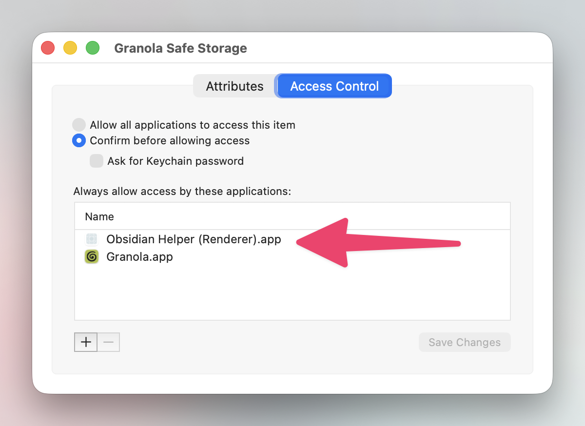

# Obsidian Granola Sync

[](https://github.com/tomelliot/obsidian-granola-sync/actions/workflows/release.yml)
[](https://codecov.io/gh/tomelliot/obsidian-granola-sync)

<a href="https://buymeacoffee.com/tomelliot"></a>

This plugin allows you to synchronize your notes and transcripts from Granola (https://granola.ai) directly into your Obsidian vault. It fetches documents from Granola, converts them from ProseMirror JSON format to Markdown, and saves them as `.md` files.

## Features

- Sync Granola notes to your Obsidian vault
- Sync Granola transcripts to your vault, with flexible destination options
- Support for syncing to daily notes, a dedicated folder, or a daily note folder structure
- Optional inclusion of private notes from Granola at the top of synced notes
- Automatic bidirectional linking between notes and transcripts when using individual files
- Periodic automatic syncing with customizable interval
- Granular settings for notes and transcripts
- Customizable sync settings and destinations
- **Platform support:** This plugin only works on desktop. It is not supported on mobile.

## Installation

1. Go to [https://community.obsidian.md/plugins/granola-sync](https://community.obsidian.md/plugins/granola-sync)
2. Click Install

## How the plugin authenticates with Granola

Granola stores its credentials encrypted on disk and protects the wrapping key with the OS's user-scoped secret store — your macOS Keychain, Linux libsecret/kwallet entry, or, on Windows, the per-user Data Protection API (DPAPI). To sync, the plugin needs to read those same credentials. It does this entirely on your machine — nothing about your credentials ever leaves your computer except the access token that's sent to Granola's own API (the same destination Granola itself talks to). See [docs/CREDENTIALS.md](docs/CREDENTIALS.md) for the full decoding chain.

### macOS: first-sync prompt

The first time you sync on macOS, your operating system will ask whether to allow **Obsidian** to access the `Granola Safe Storage` keychain item. The prompt looks like a standard system dialog:

> *Obsidian Helper (Renderer) wants to use your confidential information stored in "Granola Safe Storage" in your keychain.*

Choose **Always Allow**. That records Obsidian as a trusted reader for this specific item, so future syncs don't prompt you again. You can review or revoke this consent at any time in **Keychain Access** → search `Granola Safe Storage` → double-click → **Access Control**:

<p align="center">
  
</p>

### Linux

The same flow applies — your OS will ask once (via libsecret/kwallet) whether Obsidian may read Granola's credentials. Approve once and subsequent syncs are silent.

### Windows

Granola on Windows does not store anything in Credential Manager — there is nothing to "Always Allow", and you will not see a prompt the first time you sync. Instead, Granola's wrapping key lives DPAPI-encrypted in its Electron `Local State` file under `%APPDATA%\Granola`. DPAPI is gated by your Windows login: only the same Windows user account that wrote the key can unwrap it, and the unwrap happens silently in the background. The plugin reads `Local State`, asks Windows to decrypt the wrapped key, then decrypts `stored-accounts.json.enc` exactly as it does on the other platforms. If the plugin reports a DPAPI failure, it usually means Granola was installed under a different Windows user account or the user profile was migrated — sign in to Granola again so it can rewrite `Local State` for the current user.

### Why this is safe

- **Local only.** Credential decryption happens inside the plugin process on your machine. The wrapping key is never written to disk by the plugin, never sent over the network, and never persisted outside your OS's secret store.
- **Scoped consent.** On macOS/Linux the keychain "Always Allow" grant is per-item and per-application — trusting Obsidian to read `Granola Safe Storage` doesn't give it access to anything else. On Windows, DPAPI is scoped to your Windows user account; the wrapped key cannot be decrypted by another user on the same machine, or by you on a different machine.
- **Open source.** The full implementation lives in [`src/services/credentials.ts`](src/services/credentials.ts), [`src/services/granolaCredentialsCrypto.ts`](src/services/granolaCredentialsCrypto.ts), [`src/services/keyringLoader.ts`](src/services/keyringLoader.ts), and [`src/services/dpapiLoader.ts`](src/services/dpapiLoader.ts). The native bindings are the well-maintained [`@napi-rs/keyring`](https://github.com/Brooooooklyn/keyring-node) (macOS/Linux) and [`@primno/dpapi`](https://github.com/primno/dpapi) (Windows); only the compiled binary for your platform is loaded.
- **You stay in control.** On macOS/Linux, open Keychain Access (or the equivalent) any time and remove Obsidian from the access list — the next sync will prompt you again. On Windows, signing into a different user account or removing Granola will make `CryptUnprotectData` fail; the plugin can't bypass that either.

## Configuration

1. Configure note syncing:
   - Choose whether to sync notes
   - Optionally enable "Include Private Notes" to include your raw private notes at the top of each synced note
   - Select the destination: a specific folder, daily notes, or daily note folder structure
   - Optionally set a section heading for daily notes
2. Configure transcript syncing:
   - Choose whether to sync transcripts
   - Select the destination: a dedicated transcripts folder or daily note folder structure
3. Set up periodic sync and adjust the interval as desired

## Frontmatter Structure

All synced files include structured frontmatter for tracking and identification:

**Notes:**
```yaml
---
granola_id: doc-123
title: "Meeting Title"
type: note
created: 2024-01-15T10:00:00Z
updated: 2024-01-15T12:00:00Z
attendees:
  - John Doe
  - Jane Smith
transcript: "[[Transcripts/Meeting Title-transcript.md]]"
---
```

**Transcripts:**
```yaml
---
granola_id: doc-123
title: "Meeting Title - Transcript"
type: transcript
created: 2024-01-15T10:00:00Z
updated: 2024-01-15T12:00:00Z
attendees:
  - John Doe
  - Jane Smith
note: "[[Granola/Meeting Title.md]]"
---
```

The `granola_id` is consistent across both note and transcript files for the same source document, while the `type` field distinguishes between them. This allows both file types to coexist with proper duplicate detection.

### Frontmatter Fields

- `granola_id`: Unique identifier from Granola, consistent across note and transcript files
- `title`: Document title (with "- Transcript" suffix for transcripts)
- `type`: Either `note` or `transcript`
- `created`: ISO timestamp when the document was created
- `updated`: ISO timestamp when the document was last updated
- `attendees`: Array of attendee names from the meeting
- `transcript`: Wiki-style link to the transcript file (only in notes saved as individual files, not in daily notes)
- `note`: Wiki-style link to the note (in transcripts, links to individual files or daily notes with heading anchors)

The `transcript` field is added when notes are saved as individual files and transcripts are synced. The `note` field is always added to transcripts when notes are being synced - for individual note files, it links to the file path; for daily notes, it links to the daily note file with a heading anchor (e.g., `[[2024-01-15#Meeting Title]]`).

## Note Content Structure

When the "Include Private Notes" setting is enabled and a document has private notes content, synced notes will include:

1. **## Private Notes** section - Contains your raw private notes from Granola
2. **## Enhanced Notes** section - Contains the processed note content from Granola

When private notes are disabled or not present, notes display the content directly without section headings.

For combined notes (notes with transcripts), the structure is: Private Notes → Enhanced Notes → Transcript.

## Documentation

For detailed information about how the sync process works, see [Sync Process Documentation](docs/sync-process.md). This document explains the credentials loading, document fetching, note syncing, transcript syncing, frontmatter structure, file deduplication, and error handling mechanisms.

## Development

### Prerequisites

- Node.js 18 or later
- npm

### Setup

1. Clone the repository
2. Install dependencies:
   ```bash
   npm install
   ```

### Building

To build the plugin:
```bash
npm run build
```

### Testing

The plugin uses Jest for testing. To run the tests:

```bash
# Run all tests
npm test

# Run tests in watch mode
npm run test:watch

# Run tests with coverage
npm run test:coverage
```

For detailed testing information, including testing strategy and development workflow, see [CONTRIBUTING.md](CONTRIBUTING.md).

### Releasing

To create a release:

```bash
# Auto-bump patch version
node scripts/release.js

# Specify a specific version
node scripts/release.js 1.2.3
```

## Contributing

Please see [CONTRIBUTING.md](CONTRIBUTING.md) for info on contributing to this project.

## License

MIT

## Disclaimer

This plugin is an independent project and is not affiliated with, endorsed by, or sponsored by Granola. It uses Granola's own API and credential files only on your local machine, with credentials you've already authenticated through the official Granola app. Do not use this plugin in any way that breaks [Granola's Terms of Service](https://www.granola.ai/terms) — you are responsible for ensuring your use complies with them.
