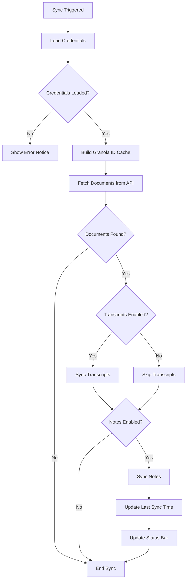
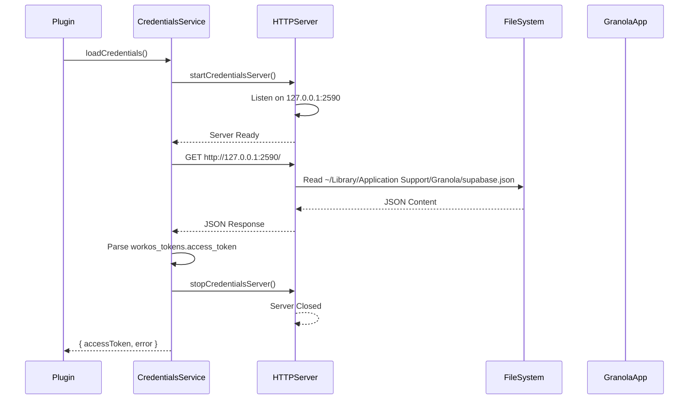
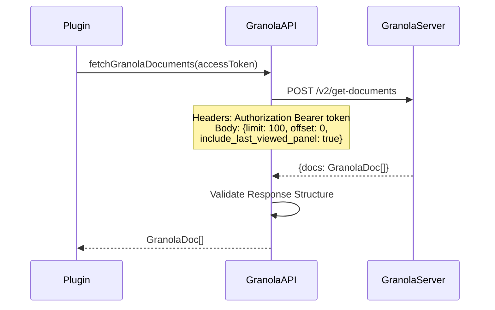
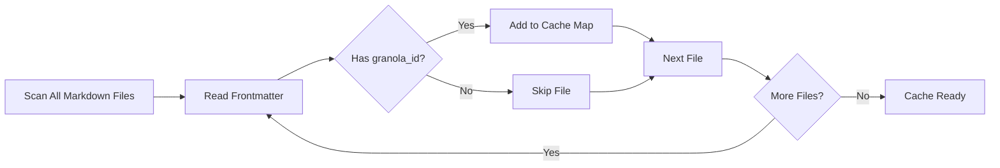
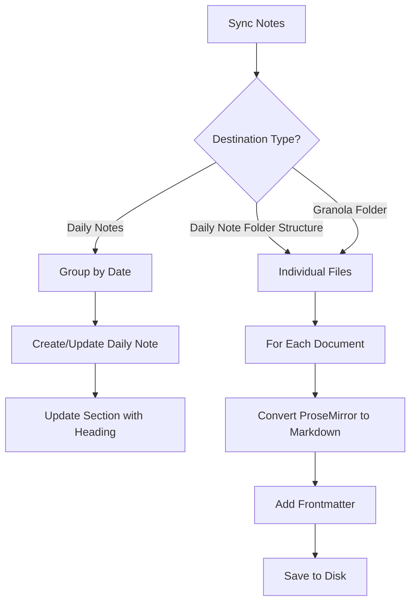
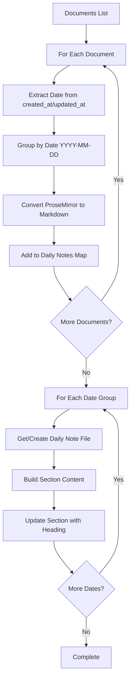
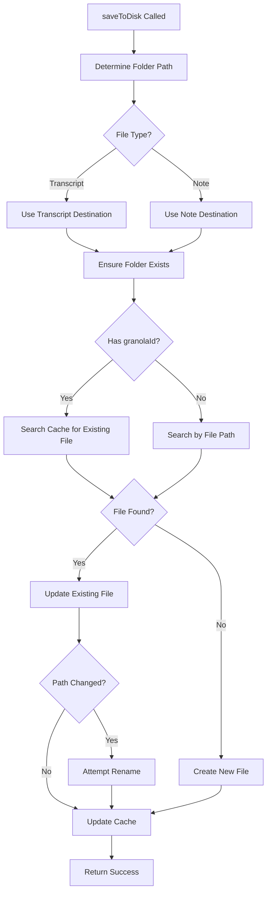

# Granola Sync Process Documentation

This document explains how the Granola Sync plugin synchronizes notes and transcripts from Granola to Obsidian.

## Overview

The sync process retrieves documents and transcripts from the Granola API and saves them to the Obsidian vault. The plugin supports multiple sync destinations and handles deduplication through Granola ID tracking.

## High-Level Sync Flow

## Credentials Loading

The plugin loads credentials from a local file via a temporary HTTP server. This approach allows secure access to credentials stored in the Granola application's data directory.

### Credentials Loading Flow

### Credentials Service Details

- **File Location**: `~/Library/Application Support/Granola/supabase.json`
- **Server Port**: `2590` (localhost only)
- **Token Path**: `workos_tokens.access_token` within the JSON structure
- **Server Lifecycle**: Started before each sync, closed immediately after token extraction

## Document Fetching

The plugin fetches documents from the Granola API using the loaded access token.

### API Request Flow

### Document Structure

Each `GranolaDoc` contains:

- `id`: Unique Granola document identifier
- `title`: Document title
- `created_at`: Creation timestamp (optional)
- `updated_at`: Last update timestamp (optional)
- `last_viewed_panel.content`: ProseMirror document structure (optional)

### Error Handling

The plugin handles various HTTP error codes:

- **401**: Authentication failed (token expired)
- **403**: Access forbidden
- **404**: API endpoint not found
- **500+**: Server errors
- **Other**: Network or connection errors

## Granola ID Cache

Before syncing, the plugin builds a cache mapping Granola IDs to existing Obsidian files. This enables efficient deduplication.

### Cache Building Process

**Cache Structure**: `Map<granolaId, TFile>`

- Key: Granola document ID (or `{docId}-transcript` for transcripts)
- Value: Obsidian `TFile` reference

## Note Syncing

Notes can be synced to three different destinations, each with different behavior:

### Note Sync Destinations

### Daily Notes Destination

When syncing to daily notes, documents are grouped by date and inserted into sections within daily note files.

**Section Format**:

- Heading: User-configured section heading (trimmed)
- Each note includes:
  - H3 title
  - Granola ID
  - Created/Updated timestamps
  - Optional transcript link
  - Note content

## File Saving and Deduplication

The `saveToDisk` method handles file creation, updates, and deduplication.

### Save to Disk Flow

### Deduplication Strategy

1. **Primary**: Search by Granola ID in cache
2. **Fallback**: Search by computed file path
3. **Update**: If file exists, update content
4. **Rename**: If path changed (e.g., title changed), rename file
5. **Cache Update**: Always update cache after save

### File Path Computation

Path computation depends on the destination type:

**Daily Note Folder Structure**:

- Uses daily note format settings
- Extracts folder structure from date format
- Combines with base daily notes folder

**Granola Folder / Granola Transcripts Folder**:

- Uses configured folder path directly
- Normalizes path separators

**Filename Sanitization**:

- Removes invalid characters: `<>:"/\|?*`
- Replaces spaces with underscores
- Truncates to 200 characters maximum

## Summary

The sync process orchestrates multiple components:

1. **Credentials Management**: Secure loading via temporary HTTP server
2. **API Communication**: Fetching documents and transcripts from Granola API
3. **Deduplication**: Using Granola ID cache to prevent duplicates
4. **Content Conversion**: ProseMirror to Markdown transformation
5. **File Management**: Creating/updating files in appropriate locations
6. **Error Handling**: Comprehensive error reporting and recovery

The plugin supports flexible sync destinations and maintains data integrity through ID-based deduplication and careful file management.
